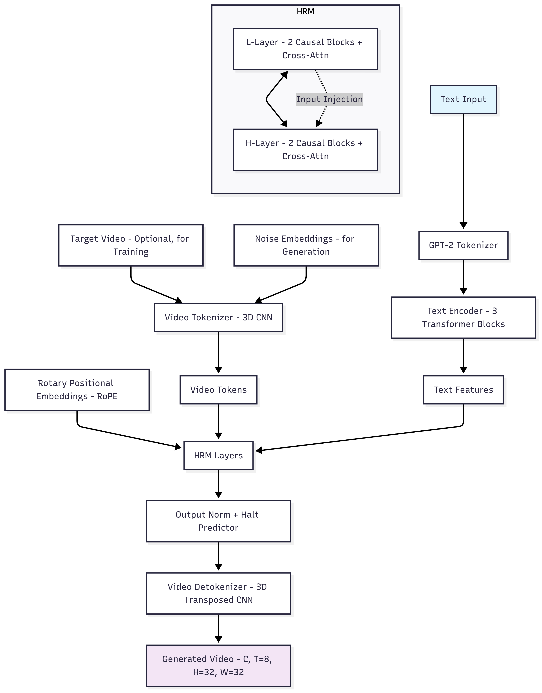
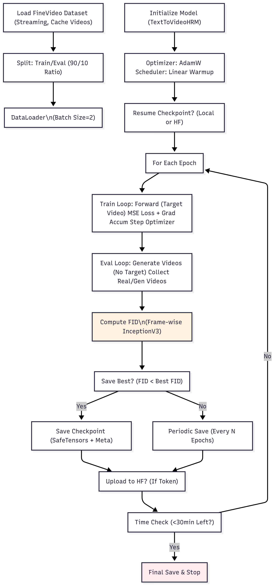

# Text-to-Video Hierarchical Reasoning Model (TTV-HRM)
[](https://huggingface.co/XCollab/TTV-HRM)

[](https://opensource.org/licenses/MIT)


This repository implements a **Text-to-Video generation model** using a **Hierarchical Reasoning Model (HRM)** optimized for T4 GPUs. The model leverages transformer-based architectures with rotary positional embeddings, SwiGLU feed-forward networks, and 3D CNNs for video tokenization/detokenization. It is trained on the FineVideo dataset and supports checkpointing to Hugging Face.

## Key Features
- **Modular Design**: Code is split into logical modules for models, data handling, utilities, and training/testing scripts.
- **GPU Optimization**: Configured for T4 GPUs with TF32 and CuDNN benchmarks.
- **Hierarchical Reasoning**: Uses high-level (H) and low-level (L) reasoning layers with text conditioning and early stopping.
- **Evaluation**: Computes Fréchet Inception Distance (FID) for video quality assessment.
- **Checkpointing**: Supports saving/loading from local paths or Hugging Face repos using SafeTensors.
- **Generation**: Outputs videos as GIFs for easy visualization.

## Project Structure
```
ttv-hrm/
├── main.py                  # Entry point to run training and testing
├── train.py                 # Training loop with FID evaluation
├── test.py                  # Inference and GIF generation
├── models/                  # Model components
│   ├── __init__.py
│   ├── components.py        # Attention, TransformerBlock, RotaryEmbedding, etc.
│   ├── text_encoder.py      # TextEncoder class
│   ├── video_processing.py  # VideoTokenizer and VideoDetokenizer
│   └── hrm.py               # HRMLayer and TextToVideoHRM
├── data/                    # Data handling
│   ├── __init__.py
│   ├── dataset.py           # TextVideoDataset (streaming from FineVideo)
│   └── tokenizer.py         # ProperTokenizer (GPT-2 based)
└── utils/                   # Utilities
    ├── __init__.py
    ├── device.py             # Device setup
    ├── initialization.py     # RMSNorm, trunc_normal_init
    ├── evaluation.py         # FID computation
    └── checkpoint.py         # Save/load checkpoints
├── checkpoints/             # Local checkpoints (auto-created)
├── video_cache/             # Cached video frames (auto-created)
└── README.md                # This file
```

## Installation
1. **Clone the Repository**:
   ```
   git clone https://github.com/codewithdark-git/TTV-HRM
   cd TTV-HRM
   ```

2. **Install Dependencies** (Python 3.10+):
   ```
   pip install torch torchvision torchaudio --index-url https://download.pytorch.org/whl/cu118  # For CUDA 11.8 (T4 compatible)
   pip install transformers datasets decord imageio torchmetrics safetensors huggingface_hub tqdm numpy
   ```

3. **Hugging Face Token** (Optional, for checkpoint upload):
   - Create a token at [huggingface.co/settings/tokens](https://huggingface.co/settings/tokens).
   - Update `hf_token` in `main.py`.

## Usage

### Training
Run the full training pipeline (3 epochs, 50 samples, 4-hour limit):
```
python main.py
```
- **Customization**: Edit parameters in `train_text_to_video()` call in `main.py` (e.g., `epochs=10`, `max_samples=100`).
- **Resume from HF**: Set `from_hf=True` and provide `repo_id` (e.g., "yourusername/TTV-HRM").
- **Local Resume**: Checkpoints in `./checkpoints/` are auto-detected.
- **Output**: 
  - Training loss and FID printed per epoch.
  - Best model saved based on FID.
  - Checkpoints uploaded to HF if token provided.

### Testing/Inference
After training, the script auto-runs tests:
- Generates videos for sample prompts (e.g., "a red ball moving left to right").
- Saves GIFs in the current directory (e.g., `generated_video_1_a_red_ball_moving_left_to_right.gif`).
- To run tests standalone:
  ```
  python -c "from test import test_text_to_video_generation; from models.hrm import TextToVideoHRM; from utils.device import set_device; device=set_device(); model=TextToVideoHRM({...config...}).to(device); test_text_to_video_generation(model, device)"
  ```

### Configuration
The model config is defined in `train.py`:
```python
config = {
    'hidden_size': 256,
    'num_heads': 8,
    'expansion': 2.0,
    'vocab_size': 50257,
    'max_text_len': 77,
    'frames': 8,
    'height': 32,
    'width': 32,
    # ... (see code for full config)
}
```

## Model Architecture Overview

The TTV-HRM model processes text inputs to generate short video clips through a hierarchical reasoning mechanism. Below is a high-level diagram of the architecture:



### Key Components Breakdown
1. **Text Encoding**: GPT-2 tokenizer + 3-layer transformer (non-causal) to extract conditioning features.
2. **Video Tokenization**: 3D CNN to flatten video (C, T=8, H=32, W=32) into sequence of tokens (~256 tokens).
3. **HRM Core**:
   - **L-Layer**: Fine-grained reasoning (2 causal transformer blocks + cross-attention to text features).
   - **H-Layer**: Coarse-grained reasoning (similar structure, conditioned on L-layer outputs).
   - **Iteration**: Up to 3 reasoning steps with rotary embeddings (RoPE) and early halting based on sigmoid predictor.
4. **Detokenization**: 3D transposed CNN to reconstruct normalized video frames (tanh activation, [-1,1] range).
5. **Loss**: MSE between predicted and target videos during training.

## Training Pipeline

The training flow includes data loading, forward passes, loss computation, and evaluation:



## Evaluation
- **FID Score**: Frame-wise Fréchet Inception Distance using InceptionV3 features (2048-dim).
- **Interpretation**: Lower FID indicates higher similarity between real and generated video frames (e.g., <50 is reasonable for low-res videos).
- **Computation**: Processes all frames from eval batches; denormalizes to [0,255] uint8 for Inception input.

Example FID Progression (Hypothetical from Training):
| Epoch | Train Loss | FID Score |
|-------|------------|-----------|
| 1     | 0.45       | 120.5     |
| 2     | 0.32       | 85.2      |
| 3     | 0.28       | 62.1      |

## Limitations & Notes
- **Dataset**: Uses streaming from FineVideo (50 samples by default for speed; increase `max_samples` for better training). Videos are resized to 32x32x8 for efficiency.
- **Video Resolution**: Low-res output for T4 efficiency; modify `output_shape` in config for higher res (may require more VRAM).
- **Time Limit**: Hard-stop after ~4 hours to fit session limits; adjustable via `max_training_time_hours`.
- **Dependencies**: No internet during training (all libs pre-installed). Decord for video reading, ImageIO for GIF export.
- **HF Upload**: Requires write access to the repo; uses SafeTensors for secure, efficient storage.

## Contributing
- Fork and PR for improvements (e.g., higher res support, additional datasets like Kinetics, or diffusion-based enhancements).
- Report issues for bugs or feature requests.

## License
MIT License. See LICENSE for details.

For questions, open an issue!
